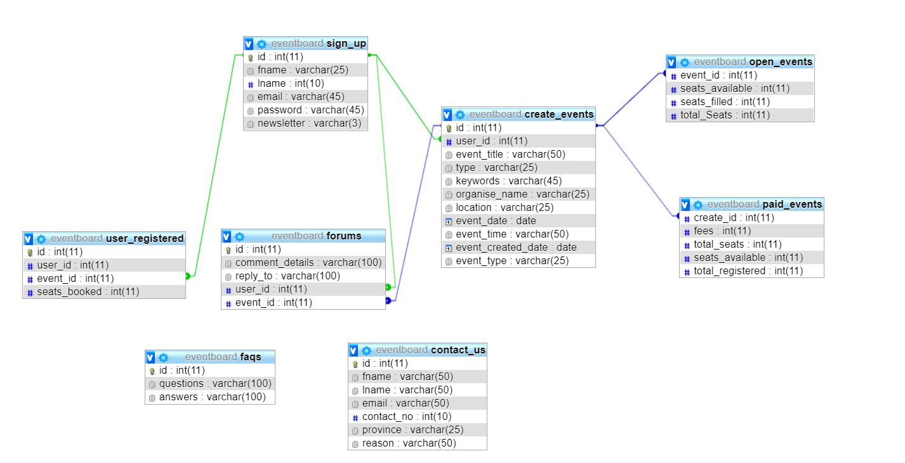

## Project Title
EventBoard Management System

## Description
<ul>
	<li>This is a website for all kinds of events ranging from small meetups to large events.</li>
	<li>Popular for smaller events or meetup events.</li>
	<li>You can use it to send email confirmations and reminders.</li>
	<li>User can go register to free events or paid events.</li>
</ul>

## Working
The project starts executing with the home page which is Index.php.
admininterface.php works when the event database(script included) is created. 

## Work Done By
<ol>
	<li>Admin Panel -  Abhiroop Singh</li>
	<li>Login Page ,Signup Page, About Us , Create Event page-  Zenil Soni</li>
	<li>Home Page, FAQs, File Integration, Contact Us page-  Minal Patel</li>
</ol>

## Database Design
